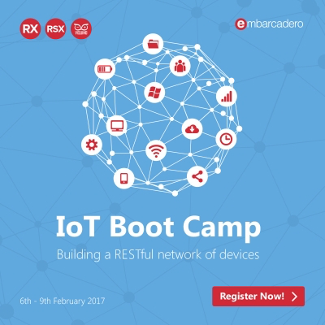

```
Roberto Nogueira  
BSd EE, MSd CE
Solution Integrator Experienced - Certified by Ericsson
```
# Project Delphi IoT Bootcamp 2017



**About**

Learn everything you need to about the subject of this `Project`.

[Homepage](https://community.embarcadero.com/blogs/entry/iot-bootcamp-2017)

## Topics
```
[ ] Day 1 - Rapidly customize and connect to Arduino based IoT device projects.
[ ] Day 2 - Using RAD Studio, programmatically connect and configure your own IoT devices (through Bluetooth and app-tethering).
[ ] Day 3 - Build an auto-managing connected network of IoT devices that employs a unified REST API—using RAD Server and ThingPoints.
[ ] Day 4 - Connect to the IoT network with your favorite programming languages, including consuming YAML into Swagger to create code for use in other languages.
```
